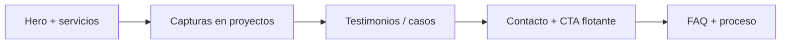

# apolinux.github.io

Portfolio profesional de **Carlos Arce** — Full Stack Developer.

- **Sitio en vivo:** [https://apolinux.github.io/](https://apolinux.github.io/)
- **Repositorio:** sitio estático (HTML + Tailwind CDN) desplegado en GitHub Pages

Este documento incluye **documentación técnica del proyecto** (formulario de contacto) y una **hoja de ruta** con sugerencias para hacer el sitio más atractivo a clientes potenciales.

---

## Estado actual (fortalezas)

El portfolio ya cuenta con:

- Meta tags SEO, Open Graph y Twitter Card
- JSON-LD (`WebSite`, `Person`)
- Idiomas ES / EN
- Tema claro / oscuro
- Hero orientado a negocio y sección **Servicios** (`#servicios`)
- Cuatro demos con fichas, galerías, filtros por sector y resultados de negocio
- **Testimonios**, mini casos, **Proceso** (`#proceso`), **FAQ** (`#faq`)
- Foto profesional en Sobre mí y CTA flotante en móvil
- Formulario de contacto con **Formspree** (envío AJAX, sin recargar la página)
- Enlaces a GitHub, LinkedIn, X y Telegram

El salto más grande para **convertir visitas en clientes** está en el mensaje comercial, la prueba social y la evidencia visual de los proyectos — no solo en el diseño.

---

## Formulario de contacto (Formspree)

El sitio usa **Vanilla JS + AJAX** (no React ni `@formspree/ajax`), acorde al stack: HTML estático en GitHub Pages con JavaScript propio, i18n ES/EN y tema claro/oscuro.

### Endpoint

```
https://formspree.io/f/maqkopbv
```

Form ID: `maqkopbv`

### Campos enviados

| Campo (`name`) | Tipo     | Requerido | Descripción        |
|----------------|----------|-----------|--------------------|
| `name`         | text     | Sí        | Nombre del visitante |
| `email`        | email    | Sí        | Email de respuesta |
| `subject`      | text     | Sí        | Asunto del mensaje |
| `message`      | textarea | Sí        | Cuerpo del mensaje |
| `_gotcha`      | text     | No        | Honeypot anti-spam (oculto) |

### Comportamiento en `index.html`

1. **Progresivo:** el `<form>` declara `action` y `method="POST"` hacia Formspree por si JavaScript no está disponible.
2. **AJAX:** `submit` interceptado con `fetch`, `FormData` y cabecera `Accept: application/json` para no redirigir fuera del portfolio.
3. **UX:** botón deshabilitado mientras envía, mensaje de error visible, pantalla de éxito y botón «Enviar otro mensaje».
4. **Canales paralelos:** Telegram sigue disponible en la misma sección de contacto.

### Fragmento de integración (referencia)

```html
<form id="contact-form" action="https://formspree.io/f/maqkopbv" method="POST">
  <input type="text" name="_gotcha" tabindex="-1" autocomplete="off" class="hidden" aria-hidden="true">
  <input type="text" name="name" required>
  <input type="email" name="email" required>
  <input type="text" name="subject" required>
  <textarea name="message" required></textarea>
  <button type="submit">Enviar</button>
</form>
```

```javascript
const response = await fetch('https://formspree.io/f/maqkopbv', {
  method: 'POST',
  body: new FormData(contactForm),
  headers: { Accept: 'application/json' }
});
```

### Traducciones (i18n)

Claves en `translations.es` / `translations.en`:

- `contact_telegram_hint`, `form_email`, `form_email_placeholder`
- `form_sending`, `form_error_generic`, `form_send_another`
- `form_success_title`, `form_success_message` (ya existentes)

### Probar el formulario

1. Abrir el sitio (local o [apolinux.github.io](https://apolinux.github.io/)) y ir a **Contacto**.
2. Completar y enviar el formulario.
3. Verificar el mensaje en el [panel de Formspree](https://formspree.io/forms/maqkopbv/submissions).

### Configuración recomendada en Formspree

- Confirmar el formulario en el dashboard (primera vez).
- Opcional: restringir envíos al dominio `apolinux.github.io`.
- Opcional: activar reCAPTCHA si aumenta el spam.

### Documentación oficial

- [Submit forms with JavaScript (AJAX)](https://help.formspree.io/hc/en-us/articles/360013470814-Submit-forms-with-JavaScript-AJAX)
- [Formspree AJAX package](https://github.com/formspree/formspree-js/tree/master/packages/formspree-ajax) (no usado en este proyecto; se prefirió `fetch` nativo)

---

## Prioridad alta (impacto directo en clientes)

### 1. Hero orientado a negocio, no a código

**Hecho:** titular de negocio, subtítulo por sector, tagline de experiencia, CTA principal «Cuéntame tu proyecto» → `#contacto`, secundario «Ver demos».

**Referencia de copy aplicado:**

| Elemento | Propuesta |
|----------|-----------|
| Título | Desarrollo web y sistemas a medida para negocios |
| Subtítulo | Tiendas online, gestión de citas y plataformas OMS — desde la idea hasta producción |
| CTA principal | Cuéntame tu proyecto (Telegram / email) |
| CTA secundario | Ver demos |

Así se filtra mejor el tráfico y se atrae a quien busca ecommerce, salud o gestión operativa (alineado con las demos actuales).

### 2. Nueva sección: «Qué puedo hacer por ti» (servicios)

**Hecho:** sección `#servicios` con 4 tarjetas (ecommerce, citas, OMS, APIs/mantenimiento) y enlaces a demos o contacto.

| Servicio | Demo relacionada |
|----------|------------------|
| Tiendas online / ecommerce | [Tienda Online](https://tiendaonlinedemo.apolinux.work.gd/) |
| Sistemas de citas y agenda | [OMS Cime](https://cime.apolinux.work.gd), [OMS Salón](https://armymanager.apolinux.work.gd) |
| Gestión operativa / inventario | OMS Salón, [Alquiler de sillas](https://alquilersillasdemo.apolinux.work.gd) |
| APIs, integraciones, mantenimiento | Mencionar en texto (sin demo obligatoria) |

Implementación sugerida: 3–4 tarjetas con icono, beneficio en una línea y enlace al demo correspondiente.

### 3. Capturas reales en las tarjetas de proyecto

**Hecho:** cada proyecto muestra galería horizontal con todas las capturas de su carpeta en `assets/`, descripción ampliada, sector, funcionalidades y badge «Demo en vivo».

**Pendiente (opcional):**

- Lightbox al hacer clic en una captura.
- Vídeo corto del flujo principal por proyecto.

### 4. Resultados concretos por proyecto

**Hecho:** bloque `project-outcome` en cada ficha con valor de negocio (sin métricas inventadas).

**Referencia:**

- *Centraliza citas, clientes e inventario en un solo panel.*
- *Checkout y catálogo listos para validar tu modelo de negocio.*

Si hay datos reales (pilotos, clientes), usarlos. Si no, beneficios claros sin inventar métricas.

### 5. Contacto con menos fricción

**Hecho:** formulario activo con Formspree + Telegram en la misma sección.

**Pendiente / mejoras:**

- Texto de confianza: *Respuesta habitual en 24–48 h*.
- Opcional: Calendly / Google Calendar — «Agendar llamada de 15 min».
- CTA del hero «Contactar» con ancla directa al formulario (`#contacto`).

### 6. Prueba social (testimonios / casos)

**Hecho:** sección `#testimonios` con 3 testimonios por sector y 4 mini casos enlazados a proyectos.

**Referencia (contenido genérico por sector, sin nombres de clientes):**

- 2–3 testimonios cortos (nombre, rol, empresa o sector).
- Mini casos: problema → solución → stack → enlace demo.

Si no se pueden nombrar clientes: usar sector (*Clínica privada — sistema de citas*).

---

## Prioridad media (diferenciación y confianza)

### 7. Foto profesional y tono humano en «Sobre mí»

**Hecho:** foto `assets/img/Carlos-Arce.png`, frase personal y textos orientados a negocio.

### 8. Sección «Cómo trabajo» (proceso)

**Hecho:** sección `#proceso` con 4 pasos y plazo orientativo MVP 4–8 semanas.

**Referencia:**

1. Brief del proyecto  
2. Propuesta y alcance  
3. Desarrollo + demos iterativas  
4. Entrega y soporte  

Incluir plazos orientativos según la realidad del negocio (*MVP en 4–8 semanas*, etc.).

### 9. FAQ para objeciones típicas

**Hecho:** sección `#faq` con acordeón nativo (`<details>`) y 4 preguntas.

- ¿Trabajas por proyecto o por horas?  
- ¿Ofreces mantenimiento?  
- ¿Quién es dueño del código?  
- ¿Qué necesito para empezar?  

Filtra curiosos y acerca clientes con intención real.

### 10. CTA persistente en móvil

**Hecho:** botón flotante `#floating-cta` visible en móvil tras 400px de scroll.

### 11. Agrupar proyectos por tipo de cliente

**Hecho:** filtros Todos / Belleza / Salud / Retail / Gestión con `data-categories` en cada proyecto.

### 12. Consistencia visual de todas las tarjetas

**Hecho:** todos los proyectos usan `theme-card-bg`, `theme-text-*` y el mismo layout de ficha ampliada.

---

## Prioridad baja (largo plazo / SEO)

### 13. Casos de estudio detallados

Enlace «Ver caso completo» por proyecto: más capturas, stack, aprendizajes (página HTML simple o sección dedicada).

### 14. Blog o notas técnicas

Artículos cortos (*Cómo monté una tienda demo con Supabase*) para tráfico orgánico y demostración de expertise.

### 15. Rendimiento

Tailwind por CDN y scripts externos afectan Lighthouse. Build estático optimizado refuerza la credibilidad técnica ante clientes exigentes.

### 16. Analytics con eventos

Medir clics en «Ver Demo», Telegram y email para iterar hero y CTAs según datos reales.

---

## Cambios de copy rápidos (sin rediseño)

| Ubicación | Texto actual (aprox.) | Sugerencia |
|-----------|------------------------|------------|
| Hero | Código limpio y eficiente | Sistemas web que automatizan citas, ventas y operaciones de tu negocio |
| Subtítulo profesional | Full Stack Developer | Desarrollador Full Stack · Ecommerce · OMS · Apps web |
| Botón contacto | Contactar | Hablemos de tu proyecto |
| Proyectos | Ver Demo | Ver demo en vivo + etiqueta de sector (Ecommerce, Salud, Gestión) |

---

## Orden de implementación recomendado



| Fase | Tareas |
|------|--------|
| 1 | Hero orientado a negocio + sección servicios + CTAs — ✅ |
| 2 | Screenshots en tarjetas de proyecto — ✅ |
| 3 | Testimonios o mini casos de estudio — ✅ |
| 4 | Contacto claro (Formspree + Telegram + promesa de respuesta) — ✅ |
| 5 | FAQ + sección «Cómo trabajo» — ✅ |

---

## Demos actuales (referencia)

| Proyecto | URL | Sector | Capturas (`assets/`) |
|----------|-----|--------|----------------------|
| OMS Salón de Belleza | https://armymanager.apolinux.work.gd | Belleza / gestión | `armymngr/` (7 imágenes) |
| OMS Cime | https://cime.apolinux.work.gd | Salud / citas | `cime/` (5 imágenes) |
| Alquiler de Sillas | https://alquilersillasdemo.apolinux.work.gd | Gestión / reservas | `alquilersillas/` (13 imágenes) |
| Tienda Online (TeeHaus) | https://tiendaonlinedemo.apolinux.work.gd/ | Ecommerce / retail | `tiendaonline/` (5 imágenes) |

Anclas en el sitio: `#proyecto-armymngr`, `#proyecto-cime`, `#proyecto-alquilersillas`, `#proyecto-tiendaonline`.

---

## Resumen

El sitio **se ve bien y es creíble técnicamente**. Para clientes potenciales conviene reforzar:

1. **Claridad de oferta** — qué compran y para qué sectores.  
2. **Evidencia visual** — capturas de las demos en producción.  
3. **Confianza humana** — foto, testimonios, proceso y contacto sin fricción.

---

## Licencia y contacto

- **Autor:** Carlos Arce  
- **Email:** apolinux@gmail.com  
- **GitHub:** [apolinux](https://github.com/apolinux/)  
- **LinkedIn:** [carlos-arce-3572244](https://www.linkedin.com/in/carlos-arce-3572244/)
